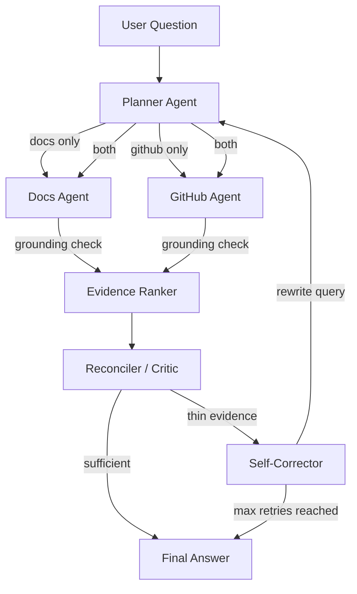

# Architecture & Interview Prep Write-Up

## Problem This Solves

A naive RAG system retrieves semantically similar chunks and answers — even when those chunks are **stale**, **from the wrong source**, or **contradict each other**. This agent addresses six specific production failure modes.

---

## Architecture Diagram



---

## State Schema

The shared `AgentState` (TypedDict) carries clean separation between nodes:

| Field | Set By | Purpose |
|---|---|---|
| `question` | Input | Original user question |
| `route`, `route_reason` | Planner | Which sources to query |
| `docs_evidence`, `github_evidence` | Agent nodes | Per-source retrieval (parallel fan-in via reducer) |
| `docs_grade`, `github_grade` | Agent nodes | Grounding/relevance scores |
| `ranked_evidence` | Evidence Ranker | Composite-ranked evidence list |
| `conflict_detected`, `conflict_details` | Reconciler | Source disagreement |
| `evidence_sufficient` | Reconciler | Whether to answer or self-correct |
| `retry_count`, `rewritten_query` | Self-Corrector | Loop control |
| `final_answer`, `citations`, `reasoning_trace` | Answer Generator | Output |

---

## Node Responsibilities

### 1. Planner Agent
**Failure mode addressed:** Querying all sources for every question wastes tokens and introduces noise.

Routes to `docs`, `github`, or `both` based on question intent. A question about "when was X changed" should not search documentation.

### 2. Docs Agent / GitHub Agent (parallel)
**Failure mode addressed:** Bad retrieval silently polluting the final answer.

Each agent retrieves from its vector store, then an LLM grades whether the results are **grounded** (factually present in the chunk) and **relevant** (actually helps answer the question). Poorly graded items are filtered before ranking.

### 3. Evidence Ranker
**Failure mode addressed:** Ranking by cosine similarity alone returns old but well-worded docs over recent commits that reflect reality.

Composite score formula:
```
score = 0.35×relevance + 0.25×grounding + 0.25×recency + 0.15×authority
```

Authority weights: PRs (0.90) > docs (0.85) > commits (0.75).

### 4. Reconciler / Critic
**Failure mode addressed:** Sources disagree and the LLM silently picks one perspective.

Explicitly compares docs vs GitHub evidence. If they conflict (e.g., docs say OAuth 2.0, commits show API key migration), both perspectives are surfaced in the UI with a "⚠️ Conflict Detected" panel.

### 5. Self-Correction Loop (bounded)
**Failure mode addressed:** Weak retrieval with no recovery — the system says "I don't know" on the first try.

If evidence is insufficient, the query is rewritten (not just retried with the same text) and the pipeline re-runs. Capped at 2 retries to prevent infinite loops.

### 6. Answer Generator
Produces the final answer with inline citations to doc names/sections or commit SHAs / PR numbers.

---

## Conditional Edge Logic

### Planner Routing
```python
if route == "docs":    → docs_agent
if route == "github":  → github_agent
if route == "both":    → Send(docs_agent) + Send(github_agent)  # parallel
```

### Self-Correction Loop
```python
if evidence_sufficient:           → answer_generator
elif retry_count >= max_retries:  → answer_generator  # answer with what we have
else:                             → self_corrector → planner  # loop
```

---

## Vector Store & Embedding Choice

| Choice | Rationale |
|---|---|
| **ChromaDB** (persistent local) | No external service needed; works on Streamlit Cloud / HF Spaces; easy reset per session |
| **HuggingFace all-MiniLM-L6-v2** (local) | Free, no API key; Groq has no embedding API; 384 dims, fast on CPU |
| **Groq llama-3.3-70b-versatile** | Fast LPU inference for planner, grading, reconciliation, answer generation |
| **RecursiveCharacterTextSplitter** | Respects markdown headings (`\n## `) for better chunk boundaries |

---

## Sample Data Structures

### Doc Chunk (in Chroma metadata)
```json
{
  "source_type": "docs",
  "doc_name": "authentication_guide.pdf",
  "section": "Overview",
  "chunk_index": 0
}
```

### GitHub Item (in Chroma metadata)
```json
{
  "source_type": "github",
  "item_type": "pr",
  "pr_number": 142,
  "sha": "",
  "title": "Migrate authentication from OAuth2/SAML to API keys",
  "author": "priya-sharma",
  "timestamp": "2025-03-15T14:30:00+00:00",
  "url": "https://github.com/acme-corp/nexus-integration-hub/pull/142"
}
```

---

## LangGraph Concepts Demonstrated

| Concept | Implementation |
|---|---|
| `StateGraph` with shared schema | `src/state.py` + `src/graph.py` |
| Conditional edges | Planner routing + reconciler → self-correct |
| Parallel fan-out + fan-in | `Send("docs_agent")` + `Send("github_agent")` → evidence_ranker |
| Cyclical loop edge | self_corrector → planner (bounded by `max_retries`) |
| Distinct critic node | reconciler alters flow based on conflict/sufficiency |
| Clean state separation | Each node reads/writes specific state fields |

---

## Interview Talking Points

1. **"How is this different from basic RAG?"**
   → Six layers beyond retrieve-then-generate: routing, per-source grounding, composite ranking, reconciliation, self-correction, and citation tracking.

2. **"What happens when docs are stale?"**
   → The reconciler detects conflicts between docs and recent commits. The ranker weights recency. The answer presents both perspectives.

3. **"How do you prevent infinite loops?"**
   → `max_retries = 2` hard cap. After max retries, the system answers with whatever evidence it has and notes low confidence.

4. **"Why LangGraph over a simple chain?"**
   → Chains are linear. This workflow needs conditional routing, parallel execution, and cyclical self-correction — all first-class in StateGraph.

5. **"Why ChromaDB over Pinecone/Weaviate?"**
   → For a demo, zero external dependencies means it deploys anywhere (Streamlit Cloud, HF Spaces) without provisioning infra. Production would likely use a managed store with multi-tenant isolation.

---

## Incremental Build Plan (What Was Built In Order)

1. **State schema + Pydantic models** — foundation everything else depends on
2. **Vector store + ingestion** — get data in, verify with `collection_stats()`
3. **Individual nodes in isolation** — test planner routing, grading, ranking separately
4. **LangGraph wiring** — conditional edges, parallel Send, self-correction loop
5. **Streamlit Setup screen** — build KB, verify indexing summary
6. **Streamlit Chat + reasoning panel** — the interview differentiator UI
7. **Sample data + test cases** — guaranteed conflict scenario
8. **Deployment config** — Streamlit Cloud / HF Spaces ready
